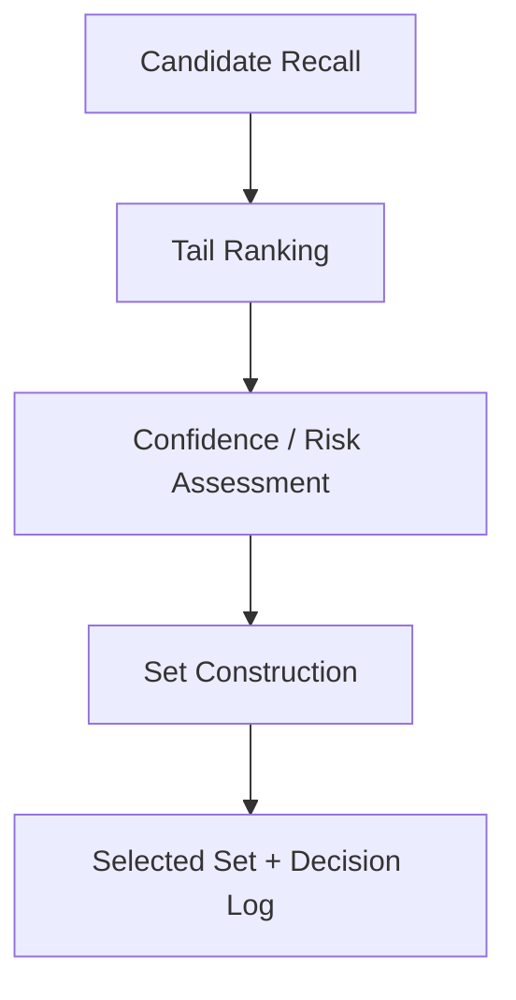

# M3Top3 Forward Model Workbench Architecture and Preregistration v0.1

## 0. Control header

| Field | Exact value |
|---|---|
| Artifact class | `OUTCOME_NONRESPONSIVE_MODEL_WORKBENCH_ARCHITECTURE_AND_PREREGISTRATION_CANDIDATE` |
| Artifact state | `AUTHORING_CANDIDATE / NOT_VALIDATED / NOT_ACTIVE` |
| Authoring Persona | `AAA-MODEL-ARCHITECT (MOD)` |
| Paired validator | `AAA-MODEL-VALIDATOR (MODV) — OFF / NOT DISPATCHED` |
| Owner authority | `AAA-OWNER-TO-PMO-M3TOP3-G11C9-TRUTH-CORRECTION-AND-MODEL-RESUME-v1.1-20260905` |
| Owner packet SHA-256 | `de9da99e8c5a8fb392ec37867a8c08f14b459f3f6a9859e90e19dc6ac8467659` |
| Stage 1 input | `M3TOP3_FINANCE_G11C2_G11C9_TERMINAL_INCIDENT_AND_REPLAN_REPORT_v1.0.md` |
| Stage 1 input SHA-256 | `51e554b6a9577828c181ebeae8b2bb1a5787a77813b36e6618de59d1c2980720` |
| Main baseline commit / tree | `950bc98b0702cd5564e3d7b24a6624d9818dfbb9` / `dd88026ee7b706a72643d5939f1d653ddde8b987` |
| Task branch | `task/aaa/m3top3-model-workbench-20260905` |
| Official outcome data consumed | `FALSE` |
| Active v1 files modified | `0` |
| Frozen schema files modified | `0` |
| Independent validation | `NOT_PERFORMED` |
| Model performance validation | `NOT_PERFORMED` |

This document freezes a minimum, isolated development workbench design. It does not freeze or replace a model definition, scorer, feature set, PIT rule, universe rule, ranking policy, or production set policy. It does not transfer any validation status from an existing artifact.

## 1. Decision and claim ceiling

The candidate is an **interface and mechanical-behavior scaffold** for asking whether a future model can be built without entangling candidate discovery, opportunity ordering, uncertainty, risk, eligibility, and portfolio/set policy. It is deliberately nonresponsive to outcomes: no W1-W8 result, return, MFE, MAE, winner, realized rank, future price, Golden Replay, or Full Replay input may be read or represented.

The strongest claim allowed from this work is:

> The isolated synthetic workbench implements the declared contracts and deterministic author self-checks for separation, missingness preservation, outcome-field rejection, and complete row accounting.

It may not support a claim of predictive validity, economic value, calibration, recall improvement, ranking improvement, risk reduction, a winning family, Champion status, active-model equivalence, promotion readiness, release, or production readiness.

The following existing surfaces are dependencies to respect, not targets to edit:

- `tools/m3top3/core.py` for canonical JSON, SHA-256, and deterministic IDs;
- `tools/m3top3/pit_guard.py` for recursive future/outcome-field and publication-cutoff rejection;
- `tools/m3top3/model_interface.py` as the existing scorer/ranking interface, which remains unchanged;
- frozen `model_definition`, `model_score`, `score_component`, `pit_snapshot`, and `universe` schemas, which remain byte-untouched;
- active Rolling 3M v0.1 semantics, including its `30/25/20/15/5/5` components, Trigger, beta, and maturity meanings, which remain outside this workbench.

Workbench records are local development records. They are not `MODEL-DEFINITION`, `MODEL-SCORE`, `MODEL-SCORE-COMPONENT`, `PIT-SNAPSHOT`, or `UNIVERSE-RELEASE` records and must not be written into those ledgers.

The current checkout is not asserted to be the exact W1 pinned execution runtime: the current `tools/m3top3/snapshot.py` blob is `fee10678d3843d979946594f362251928a7d274a`, while the W1 plan records `b7dd94fdd9727422f478e98e68ebd01ca75a675b`. No runtime-equivalence, Golden Replay, or governed execution-target claim is therefore available. Architecturally, any later separately authorized adapter must sit **downstream of** `SnapshotBuilder` / `SnapshotStore` and consume an already materialized, cutoff-bound model-input projection. The v0.1 synthetic scaffold neither invokes nor modifies those components.

The new interfaces follow the repository's `Protocol`, frozen dataclass, exact-`Decimal`, trace, and deterministic-ID conventions. They do not emit the existing `ScoreResult`, because a synthetic opportunity signal is not a governed `MODEL-SCORE`. They also do not call the existing `RankingEngine`: its default tie state is deliberately unresolved and it does not close this workbench's cohort/status contract. The experimental local total tie rule in Section 6 is isolated and creates no active tie-policy decision.

## 2. Frozen separation architecture



The stages have one-way, typed interfaces:

1. **Candidate Recall** receives the explicitly supplied development candidate list and emits one recall trace per input row. The v0.1 reference recall adapter is identity-preserving; it performs no search, retrieval, universe inference, or candidate pruning.
2. **Tail Ranking** orders recalled rows using only the `Opportunity` input declared for the synthetic fixture. It emits a raw rank that does not consult `Confidence`, `Risk`, `Eligibility`, or `Set Policy`.
3. **Confidence / Risk Assessment** preserves two distinct assessments after raw ranking. Neither assessment may rewrite the raw score or raw rank.
4. **Set Construction** consumes the immutable raw order, separate assessments, explicit eligibility state, and one predeclared set policy. It emits selected positions plus a complete decision/substitution log. It may not back-propagate a decision into raw ranking.

Each stage is represented by an independently replaceable `Protocol`. The reference implementation is a deterministic synthetic adapter, not any of the preregistered statistical families in Section 9.

## 3. Five semantic surfaces that must remain separate

| Surface | Meaning in this workbench | May affect raw rank? | May affect selected set? | Forbidden conflation |
|---|---|---:|---:|---|
| `Opportunity` | Synthetic, exact-decimal ordering signal for a future upside/opportunity hypothesis | Yes, and only this surface in v0.1 | Indirectly through raw order | Must not absorb confidence, risk, eligibility, or outcome |
| `Confidence` | Strength/reliability assessment of the opportunity representation and its evidence | No | Only through an explicit frozen set-policy gate | Must not be used as hidden score imputation |
| `Risk` | Adverse-exposure assessment independent of low opportunity | No | Only through an explicit frozen set-policy gate | Must not be treated as negative opportunity or valuation twice |
| `Eligibility` | Explicit `TRUE`, `FALSE`, or workbench-local `UNKNOWN` gate supplied to the workbench | No | Yes, fail-closed | Must not be inferred from price, rank, confidence, or current universe state |
| `Set Policy` | Mechanical rule that maps raw order plus explicit gates to at most `set_size` selections | No | Yes | Must not silently rerank, tune, or relabel candidates |

`Eligibility.UNKNOWN` is a workbench-local uncertainty token. It does not rename or change any existing repository enum such as `UNRESOLVED`, and no mapping is written back to a governed universe object.

## 4. Input contract

### 4.1 Workbench envelope

The minimum input is one in-memory mapping with these required fields:

| Field | Type / exact constraint |
|---|---|
| `workbench_schema_version` | Exact string `model-workbench-envelope-v0.1` |
| `fixture_class` | Exact string `SYNTHETIC_NON_OUTCOME` |
| `official_outcome_data` | Exact boolean `false` |
| `snapshot_cutoff_at` | Timezone-aware ISO-8601 datetime |
| `fixture_provenance` | Mapping satisfying Section 8.2 |
| `set_policy` | Mapping with `policy_id`, integer `set_size > 0`, and exact allowed evidence-state lists |
| `candidates` | Nonempty list of candidate mappings |

The v0.1 set policy freezes these status gates for the reference fixture:

```text
eligibility_required = TRUE
allowed_confidence_states = [VERIFIED]
allowed_risk_states = [VERIFIED]
opportunity_state_required_for_raw_rank = VERIFIED
```

No confidence-score threshold, risk-score threshold, sector quota, diversity quota, turnover rule, or hidden fallback exists in v0.1. Adding one is a new workbench semantic candidate and requires a new exact target.

### 4.2 Candidate row

Every candidate requires:

- `candidate_id`, `company_id`, `security_code`, and `pit_snapshot_id` as nonempty strings; leading zeros in `security_code` are preserved;
- `eligibility.state` in `TRUE | FALSE | UNKNOWN` and a nonempty `reason_codes` list when state is not `TRUE`;
- exactly three axis mappings named `opportunity`, `confidence`, and `risk`;
- for each axis: `evidence_state`, `value`, `publication_at`, and `evidence_refs`;
- optional `metadata`, which is recursively outcome-guarded but has no ranking or selection effect.

Axis values use canonical decimal strings when present. Binary floating point, NaN, infinity, empty strings, implicit booleans, and numeric coercion from missing states are prohibited. `candidate_id` and `pit_snapshot_id` must each be unique within the envelope. Duplicate identity makes the whole envelope fail closed before partial ranking.

The existing `PITGuard` is a necessary denylist/cutoff control, not a complete positive schema validator. The workbench must therefore enforce this local required-shape/allowlist contract before running it:

- envelope keys: exactly the seven required keys in Section 4.1;
- `fixture_provenance` keys: exactly `provenance_class`, `contains_real_market_data`, `contains_official_w1_w8_data`, `contains_outcome_labels`, `source_refs`, `generator_rule_id`, and `purpose`;
- `set_policy` keys: exactly `policy_id`, `set_size`, `eligibility_required`, `allowed_confidence_states`, `allowed_risk_states`, and `opportunity_state_required_for_raw_rank`;
- candidate keys: exactly `candidate_id`, `company_id`, `security_code`, `pit_snapshot_id`, `eligibility`, `opportunity`, `confidence`, `risk`, and optional `metadata`;
- `eligibility` keys: exactly `state` and `reason_codes`;
- axis keys: exactly `evidence_state`, `value`, `publication_at`, `evidence_refs`, and optional `reason_codes`.

Unknown keys on the envelope, policy, provenance, candidate, eligibility, or axis surfaces fail closed. `metadata` alone may contain arbitrary JSON keys because it is explicitly nonsemantic; it is still recursively outcome/PIT-guarded and cannot enter any rank, selection, ID, or configuration digest except the full input-provenance digest.

### 4.3 Axis state/value validity

| Evidence state | Value rule | Workbench action |
|---|---|---|
| `VERIFIED` | Non-null canonical decimal required | May be consumed by the owning stage only |
| `UNKNOWN` | Must be null | Preserve; never infer or score as zero |
| `NOT_FOUND` | Must be null | Preserve retrieval failure; never convert to negative fact, zero, or `FALSE` |
| `PARTIAL` | Null or canonical decimal permitted | Preserve both partial value and state; v0.1 gates do not promote it to `VERIFIED` |
| `CONFLICT` | Must be null | Preserve competing evidence in refs/reasons; fail closed for owning decision |
| `STALE` | Null or canonical decimal permitted | Preserve value and stale state; v0.1 gates do not refresh or promote it |

`null` remains distinct from every named evidence state. Absence of a required axis or state is a contract error, not `UNKNOWN`.

## 5. Output contract

One successful run emits a canonical mapping with:

- `workbench_schema_version`, `workbench_run_id`, `input_digest`, `config_digest`, and `fixture_class`;
- `guard_state = PASS` only when all outcome/PIT checks pass; this is an author-mechanical state, not validation PASS;
- `candidate_traces`, sorted by UTF-8 bytes of `candidate_id`, with exactly one terminal trace per input candidate;
- `raw_ranking`, containing only raw-rankable candidates and their immutable `raw_rank`, `raw_score`, `tie_group`, and `tie_break_key`;
- `selected_set`, ordered by `set_position` and retaining the originating `raw_rank`;
- `set_decision_log`, containing one `SELECTED`, `SKIPPED`, `SUBSTITUTED`, or `UNFILLED` decision for every scanned raw-rank candidate and every unfilled slot;
- `accounting` with `input_rows`, `terminal_trace_rows`, `ranked_rows`, `unranked_rows`, `selected_rows`, `skipped_rows`, and `input_terminal_identity_match`;
- `result_digest` over canonical output with the digest field omitted.

Every candidate trace includes all five separate surfaces, recall disposition, rankability disposition, set disposition, and reason codes. A candidate that is ineligible, unknown, unverified, conflicted, stale, or unselected remains visible in the terminal output.

`input_digest` is computed from a normalized copy of the envelope in which the top-level candidate list is sorted by UTF-8 bytes of `candidate_id`. Evidence refs, reason codes, and policy allowlists must be unique and are normalized to UTF-8 byte order before hashing and output. Therefore a pure top-level candidate permutation leaves the complete result, including `input_digest` and `result_digest`, unchanged.

On an invalid envelope, the engine raises one deterministic contract exception carrying sorted violations with JSON paths. It emits no partial success and does not drop the invalid row. The caller may serialize the exception separately, but may not represent it as a successful workbench result.

No output field is mapped automatically to an active model, governed score, prediction ledger, outcome ledger, or release artifact.

## 6. Raw ranking and deterministic tie contract

The v0.1 synthetic reference tail ranker is intentionally minimal:

1. Rank only identity-preserved recalled rows whose `opportunity.evidence_state` is `VERIFIED` and whose opportunity value is a finite exact decimal.
2. Compute `tie_group` from the canonical opportunity decimal only.
3. Sort by this total key:

```text
(-opportunity_decimal, UTF8(candidate_id), UTF8(pit_snapshot_id))
```

4. Assign unique `raw_rank` values `1..N` after the total sort. Equal opportunity values retain the same `tie_group` but are resolved by bytewise identity ordering.

This diagnostic tie rule belongs only to the isolated workbench. It does not resolve or alter the existing active `RankingEngine` tie policy.

The following must be byte-identical for the same canonical input and configuration: ordering, reason-code ordering, raw ranks, set decisions, IDs, and digests. Current time, process ID, filesystem path, hash-map iteration order, locale, and input list order may not enter normative output.

## 7. Set construction and no-silent-loss contract

Set construction scans the frozen raw ranking from rank 1 downward:

- `Eligibility != TRUE` causes a logged skip with the exact eligibility reason;
- a confidence state outside the frozen allowlist causes a logged skip;
- a risk state outside the frozen allowlist causes a logged skip;
- a passing candidate occupies the next set slot until `set_size` is reached;
- when a higher-ranked candidate is skipped and a later candidate fills the open slot, the log records the skipped candidate, replacement candidate, slot, and reason codes;
- if fewer than `set_size` candidates pass, each remaining slot is explicitly `UNFILLED`.

Set position follows raw-rank order among passing candidates. Set construction never changes `raw_rank`, never synthesizes a candidate, and never silently pads a set.

No-silent-loss acceptance is exact:

```text
multiset(input candidate_id) == multiset(candidate_traces candidate_id)
input_rows == terminal_trace_rows
ranked_rows + unranked_rows == input_rows
selected candidate IDs are a subset of input candidate IDs
every nonselected candidate has a terminal disposition and reason code
```

Any failed equality is a terminal workbench error.

## 8. Outcome firewall and fixture provenance

### 8.1 Forbidden outcome guard

Before recall, the implementation must:

1. require `fixture_class=SYNTHETIC_NON_OUTCOME` and `official_outcome_data=false`;
2. call the existing `PITGuard.assert_model_inputs` recursively over every candidate using `snapshot_cutoff_at`;
3. apply a workbench-local exact denylist for `outcome`, `outcome_label`, `target`, `target_label`, `forward_return`, `realized_return`, `realized_rank`, `selection_winner`, and `top3_winner`, in addition to the existing guard fields;
4. scan optional metadata and nested lists/maps, not only declared scoring fields;
5. reject any publication timestamp after the snapshot cutoff or any invalid/non-timezone-aware publication timestamp;
6. stop before recall on any violation.

The guard may be strengthened in a successor, but it may not be weakened by configuration. A guard PASS proves only absence of declared forbidden fields and cutoff violations in the supplied synthetic envelope; it does not prove real-world PIT completeness.

### 8.2 Fixture class

The sole committed fixture is:

`tools/m3top3/model_workbench/fixtures/synthetic_candidates_v0_1.json`

Its provenance mapping must contain:

| Field | Frozen value / rule |
|---|---|
| `provenance_class` | `HAND_AUTHORED_SYNTHETIC_DEV_ONLY` |
| `contains_real_market_data` | `false` |
| `contains_official_w1_w8_data` | `false` |
| `contains_outcome_labels` | `false` |
| `source_refs` | Empty list |
| `generator_rule_id` | `M3TOP3-SYNTHETIC-CANDIDATES-v0.1` |
| `purpose` | Contract, separation, missingness, ordering, and accounting tests only |

The fixture must cover equal opportunity ties, all six evidence states, `TRUE/FALSE/UNKNOWN` eligibility, a skipped high-ranked candidate, a later substitution, an unranked candidate, and irrelevant nested metadata. Forbidden examples are constructed in test memory; they are not committed as outcome-bearing fixture data.

The runtime has no network, provider, AWS, S3, credential, environment-secret, database, ledger-write, or Git-write interface. The engine receives an in-memory mapping and returns an in-memory mapping.

## 9. Outcome-nonresponsive family preregistration

### 9.1 Mechanical preregistered invariants

The following hypotheses are frozen and testable without outcomes:

| ID | Preregistered invariant | Mechanical falsifier |
|---|---|---|
| `PR-H01-SEPARATION` | Confidence or risk changes cannot alter raw opportunity rank | Same opportunity inputs plus changed confidence/risk produces different raw ranking |
| `PR-H02-ELIGIBILITY` | Eligibility changes can alter set selection but cannot alter raw rank | Eligibility mutation changes raw ranking |
| `PR-H03-ORDER` | Candidate input permutation cannot alter canonical output | Any permutation changes any output field or digest |
| `PR-H04-MISSINGNESS` | Named evidence states remain distinct from null, zero, and false | State is coerced, collapsed, or omitted in terminal trace |
| `PR-H05-ACCOUNTING` | Every accepted input identity has exactly one terminal trace | Multiset or count equality fails |
| `PR-H06-PIT-FIREWALL` | Forbidden outcome fields and post-cutoff publications fail before recall | A prohibited field reaches any model stage |
| `PR-H07-SET-TRACE` | Every skip, substitution, and unfilled slot is explicit | Selected set cannot be reconstructed from raw rank, policy, and decision log |
| `PR-H08-IRRELEVANCE` | Adding non-forbidden irrelevant metadata cannot alter raw rank or selected set | Metadata-only change alters either decision surface |

### 9.2 Statistical family hypotheses

No family is implemented, trained, fit, tuned, scored, or selected by v0.1. The table freezes what a separately authorized successor would have to preregister before any outcome exposure.

| Family | Structural hypothesis | Required constraints and trace | Principal preregistration risk | v0.1 disposition |
|---|---|---|---|---|
| Constrained `GAM/EBM` | An additive, shape-constrained opportunity function may preserve auditability while allowing nonlinear PIT feature effects | Feature groups fixed in advance; monotonic/shape constraints explicit; contribution trace per feature; missingness indicator never hidden imputation | Post-outcome shape edits, excessive bin freedom, correlated-feature attribution instability | `INTERFACE_HYPOTHESIS_ONLY` |
| Bayesian Top-K | A posterior over candidate utility may expose rank uncertainty and selection probability without collapsing uncertainty into one point score | Prior family, likelihood, posterior approximation, Top-K functional, interval/diagnostic outputs, and prior-sensitivity plan fixed before outcomes | Prior dominance, posterior miscalibration, selection-induced certainty, unstable approximation | `INTERFACE_HYPOTHESIS_ONLY` |
| Event-to-Conversion hazard | PIT event histories may express time from observable catalyst state to a separately defined conversion event while handling right censoring | Time origin, event definition, censoring, competing risks, clock granularity, covariates, and leakage-safe risk set fixed before outcomes | Event-time ambiguity, informative censoring, future knowledge in event adjudication, repeated-event dependence | `INTERFACE_HYPOTHESIS_ONLY` |
| LambdaMART | A later nonlinear ranker may be worth evaluating only after larger preregistered data and stable leakage controls exist | Group/query construction, label, split, hyperparameters, seeds, missingness, interpretability, and stability tests pre-frozen | Small-sample overfit, outcome-responsive tuning, opaque interactions, unstable ranks | `LATER_ONLY / EXCLUDED_FROM_MINIMUM_BUILD` |

There is no family winner, preference ordering, expected uplift, metric threshold, or champion/challenger decision in this artifact. Before any future outcome-bearing comparison, a separately authorized preregistration successor must freeze the eligible data identity, outcome definition, split/holdout policy, metrics, family hyperparameters, multiplicity control, stopping rule, and claim ceiling. This v0.1 document cannot be used to justify opening those data.

## 10. Frozen minimum implementation WBS

The implementation denominator is frozen at `100 EWU`. Timing is focused engineering wall time and excludes queue, Owner, validator, remote persistence, and external-dependency wait. CRU is `NOT_CALIBRATED`; all work is constrained to local standard-library CPU/memory and no network. Reaching P90 without the row's evidence closes the row as blocked or partial; it does not authorize scope expansion.

| WBS | Exact files | Required content / completion evidence | P50 | P90 | Timing confidence | EWU |
|---|---|---|---:|---:|---|---:|
| `MWB-I1` Contracts/package | `tools/m3top3/model_workbench/__init__.py`; `tools/m3top3/model_workbench/contracts.py` | Frozen enums/dataclasses/protocols, deterministic violations, input/output contract and exported API import successfully | 20 min | 45 min | Medium | 20 |
| `MWB-I2` Reference engine | `tools/m3top3/model_workbench/workbench.py` | Four separated stages, existing PIT guard reuse, exact-decimal raw order, set decision/substitution log, canonical IDs/digests, no I/O | 30 min | 70 min | Medium | 30 |
| `MWB-I3` Synthetic fixture | `tools/m3top3/model_workbench/fixtures/synthetic_candidates_v0_1.json` | Exact fixture provenance and required state/tie/skip/substitution/unranked coverage; no real or outcome data | 10 min | 25 min | High | 10 |
| `MWB-I4` Author tests | `tools/m3top3/model_workbench/tests/__init__.py`; `tools/m3top3/model_workbench/tests/test_workbench.py` | Unit, deterministic, property-style permutation, metamorphic separation, guard, accounting, fixture and set-log checks all pass | 30 min | 70 min | Medium | 30 |
| `MWB-I5` Self-check/diff | No additional persistent file | Compile/import/test commands, repeat digest, exact diff, and unauthorized-touch check recorded in PMO completion report | 15 min | 35 min | Medium | 10 |
| **Total** | **Six code/fixture/test files** | **All 100 EWU acceptance evidence closed** | **1 h 45 min** | **4 h 05 min** | **Medium-Low** | **100** |

Any additional code, fixture, schema, receipt, manifest, model definition, report, dependency, or runtime service is outside this frozen minimum unless PMO records an explicit authorized rebase.

## 11. Author self-check acceptance matrix

These are author checks only. A passing row cannot be called MODV, ENGV, PMOV, or independent validation.

| Check class | Minimum command/test | PASS condition |
|---|---|---|
| Import/syntax | `python -m compileall -q tools/m3top3/model_workbench` | Exit `0`; public package imports without side effects |
| Unit | `python -m unittest tools.m3top3.model_workbench.tests.test_workbench` | All declared contract and stage tests pass |
| Property-style | Deterministically enumerate all permutations of the small fixture candidate list | Raw ranking and selected set identities are invariant |
| Metamorphic | Mutate only confidence, risk, eligibility, or irrelevant metadata in isolated copies | Confidence/risk/eligibility/metadata never alter raw rank; eligibility may alter only set outputs |
| Deterministic repetition | Run the same in-memory fixture at least three times and canonicalize results | Canonical output bytes and `result_digest` are identical `3/3` |
| Synthetic fixture | Load only `synthetic_candidates_v0_1.json` and assert provenance | Required cases present; real data, W1-W8 data, and outcome labels declared false/absent |
| Missingness | Exercise `VERIFIED`, `UNKNOWN`, `NOT_FOUND`, `PARTIAL`, `CONFLICT`, and `STALE` | States survive exactly; `NOT_FOUND`, null, zero, and false remain distinct |
| Tie | Use two equal opportunity decimals with reversed input order | Same UTF-8 identity tie resolution, tie group, and raw ranks |
| Set/substitution | Skip at least one higher raw rank and fill with a later passing candidate | Raw rank unchanged; skip and replacement reconstructable from log |
| Forbidden outcome | Inject each denylisted field at top, nested-map, and nested-list positions | Deterministic failure before recall; no partial result |
| PIT cutoff | Move one publication strictly after cutoff | Existing PIT guard rejects before recall |
| No silent loss | Compare input and terminal identity multisets and accounting equations | Exact equality; every nonselected row has disposition/reasons |
| Exact diff | `git diff --check` and inspect the complete task-branch diff | No whitespace error or undeclared semantic surface |
| Unauthorized touch | Compare changed paths with Stage 1 report, this document, the six WBS files, and later PMO completion/memory paths only | Active v1, existing tools, frozen schemas, outcomes, pointers, main, and Finance artifacts unchanged |

No test may import `tools.m3top3.outcome`, read `marcap-2025.parquet`, read official W1-W8 result files, call a provider, or use network/AWS/S3 credentials.

## 12. Stop rules

The MOD/ENG build must stop and return control to PMO on any of the following:

- a new authority conflict, duplicate mutable writer, changed main baseline, or inability to establish truthful candidate identity;
- any need to modify active v1, existing model/scorer/ranking code, frozen schemas, PIT/GT/universe semantics, model pointers, Finance artifacts, or release/production surfaces;
- any need to read official W1-W8 outcomes, price-path outcomes, returns, MFE/MAE, winner/rank labels, `marcap-2025.parquet`, or another outcome-bearing artifact;
- any provider, network, AWS, S3, credential, workflow, database, or remote-effect requirement;
- a fixture whose provenance, synthetic-only status, or non-outcome status cannot be established;
- nondeterminism after one bounded diagnosis, silent row loss, duplicate identity ambiguity, missingness coercion, hidden reranking, or an outcome/PIT guard escape;
- a required dependency or new file outside the frozen WBS;
- P90 reached without the applicable acceptance evidence;
- any request to claim validation, performance, winner, Champion, promotion, release, or production status.

Test failure may be corrected only within the exact frozen files and semantics. It creates no automatic validator dispatch, correction loop, revalidation, merge, or continuation authority.

## 13. Terminal authoring declaration

```text
ARCHITECTURE_PREREGISTRATION = AUTHORED_CANDIDATE
OUTCOME_RESPONSIVE_INPUTS = 0
OFFICIAL_W1_W8_INPUTS = 0
ACTIVE_V1_MUTATIONS = 0
FROZEN_SCHEMA_MUTATIONS = 0
PIT_GT_UNIVERSE_SEMANTIC_CHANGES = 0
FINANCE_EFFECTS = 0
MODEL_FAMILY_IMPLEMENTATIONS = 0
MODEL_PERFORMANCE_CLAIMS = 0
VALIDATION_PERFORMED = FALSE
LAMBDA_MART = LATER_ONLY
NEXT_AUTHORIZED_ROUTE = ENG_MINIMUM_SCAFFOLD_THEN_PMO_INTEGRATION
```
